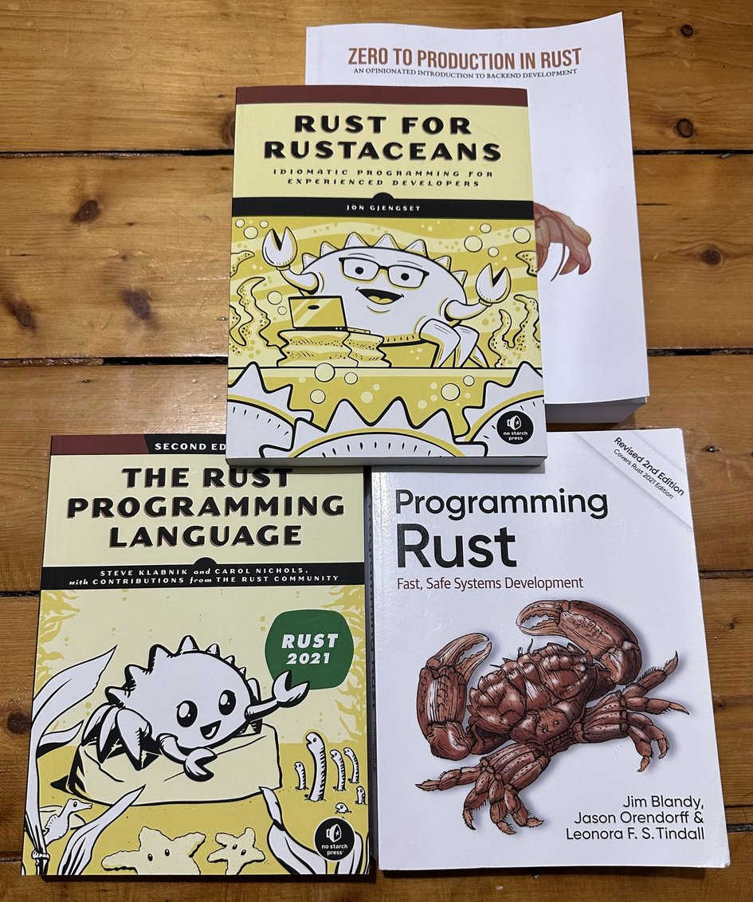
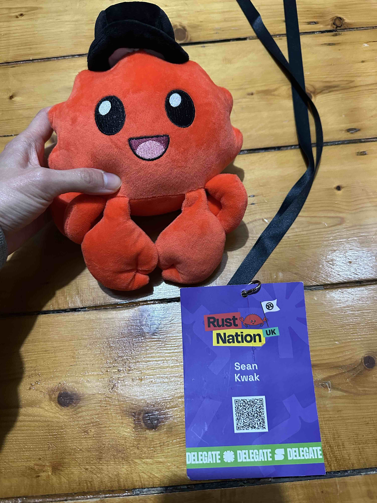

# My Rust Learning Journey

## Introduction

This repository serves as a showcase of my progress and efforts in learning the Rust programming language. It consists of four main folders, each representing a different aspect of my Rust learning journey.

## Repository Structure

### 1. `chat_program_study`

In this folder, you'll find code examples from the Udemy course "Rust Programming: The Complete Guide" (Section 17 - Asynchronous Programming). I have personally typed out the code and added comments to reinforce my understanding. The `connection_study.txt` file contains additional information from my study, demonstrating the usage of `async_std`, `tokio`, mutex, arc, and serde for JSON serialization and deserialization.

### 2. `code_example_study`

Here, I have compiled and studied examples from various sources, including YouTube tutorials, the aforementioned Udemy course, and four Rust books. I have also experimented with writing and running random code snippets to enhance my fluency in Rust.

### 3. `codewars_kata_training`

This folder contains my solutions to coding challenges from [Codewars](https://www.codewars.com/), a platform that helps developers improve their skills through coding exercises known as "katas."

### 4. `my-qustions-and-ai-answers`

In my pursuit of mastering Rust, I have sought guidance from AI-powered assistants. This folder contains a collection of questions I have asked and the corresponding answers provided by the AI, serving as a valuable resource for future reference.

## Learning and Rust Nation UK 2024

I have been diligently studying various resources, including the following books:

- "The Official Guide to Rust 2021"
- "Rust for Rustaceans"
- "Zero to Production in Rust"
- "Programming Rust"

These books have been instrumental in deepening my understanding of Rust and its ecosystem.

As an attendee of the Rust Nation UK 2024 conference, I had the opportunity to network with fellow Rust enthusiasts and gained valuable insights into the Rust community. The conference was a fantastic experience, where I connected with around 30 new people on LinkedIn and engaged in conversations with over 50 attendees.

## Conclusion

Through hands-on coding practice, study of Rust books, and engagement with the Rust community, I am continuously expanding my knowledge and proficiency in Rust. This repository reflects my ongoing learning journey and showcases my commitment to becoming a skilled Rust developer.

Feel free to explore the folders and code examples within this repository. I welcome any feedback, suggestions, or opportunities to collaborate on Rust projects.

Let's embrace the power and potential of Rust together!

Happy coding!
